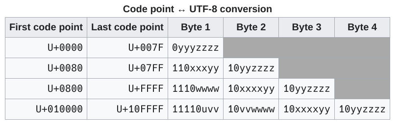

# String/Str

## String
Rust has several String types, to go deep into the rabbit hole: [All Rust string types explained](https://youtu.be/CpvzeyzgQdw?si=mlEyO666k49tX_7n).  
Here we gonna stick to the simple std::String and std::str.

Lets Start by referencing good sources:
- [Rust Book - Storing UTF-8 Encoded Text with Strings](https://rust-book.cs.brown.edu/ch08-02-strings.html) 
- [wikipedia UTF-8](https://en.wikipedia.org/wiki/UTF-8) 

LSS(Long Story Short):
In rust all strings are encode in UTF-8 we will gloss over the advantages and reasons, *google docet*.

The important thing to know is that the difference from ASCII where each symbol is represented by a byte,
in UTF-8 a symbol can be represented by up to 4 bytes.
 
```rust,editable
    // lets take the following 3 examples:
    let hello = String::from("ciao"); // c(u0063) i(u0069) a(u0061) o(u006f)
    // 你(u4f60) 好(u597d) it seems that Chinese is not so complicated ^^.
    let hello = String::from("你好");     
    // न(u0928) म(u092e) स्(u0938 u094d) ते(u0924 u0947) you cannot count chars by eyes anymore.
    let hello = String::from("नमस्ते");
    // this is super critical.
    let hello = String::from("🐖💨💩");
```
## String manipulation
### Basic String manipulation
The official docs has some good example.
- [std::String](https://doc.rust-lang.org/std/string/struct.String.html)
- [rust book chapter strings](https://rust-book.cs.brown.edu/ch08-02-strings.html)
- [rbe String](https://doc.rust-lang.org/rust-by-example/std/str.html)
```rust,editable
fn main(){
    // How to declare a string
    let mut string = String::new();
    println!("{}", string);
    let mut string = String::from("💩💩💩💩");
    println!("{}", string);

    // basic string manipulation
    let mut string = String::new();
    string.push('🐖');      // Push a utf8 character.
    println!("{}", string);
    string.push_str(", ");  // Push a string.
    println!("{}", string);
    string.push_str("नमस्ते");
    println!("{}", string);
    let ptr = string.as_ptr();  // Check address of the first character.
    println!("{:?}", ptr);
    string = string.replace("🐖", "💩"); // Will this allocate new memory? (next chapter)
    println!("{}", string);
    let ptr = string.as_ptr();
    println!("{:?}", ptr);
    let string2 = String::from("💩💩💩💩");
    string = string + &string2; // String concatenation. (next chapter)
    println!("{}", string);
}
```
### different type of strings
Rust has several types of strings, here we gonna only to show the two basics ones:
- std::strings is a string.
- std::str is the string literal or a slice.

An exaustive explanation of all strings type can be found here [All Rust string types explained](https://www.youtube.com/watch?v=CpvzeyzgQdw&t=636s).

<div class="warning">
    Aquascope at the moment cannot render string literal, so we need look directly to the addesses to determine if it is allocated in the stack or heap.
</div>

```rust,editable
fn print_type_of<T>(_: &T) {
    println!("{}", std::any::type_name::<T>());
}
fn main() {
    // Rust has several string types:
    // string literal stored into the stack and they are of type &str
    let my_str: &str = "initial contents 🍄";
    print!("String literal has type: ");
    print_type_of(&my_str);
    // It can be converted in a String type
    print!("to_string will convert it to the type: ");
    let mut my_string = my_str.to_string();
    print_type_of(&my_string);

    my_string.push_str("aa");
    let string2 = String::from("123456");
    // it is also possible to get the pointer to the string container.
    println!("my_str_ptr =    {:?} stack", my_str.as_ptr());
    println!("my_string_ptr = {:?} heap", my_string.as_ptr());
    println!("String2_ptr =   {:?} heap", string2.as_ptr());

    // slices
    println!("");
    println!("##############################################");
    println!("slices std::str can point to both stack and heap");
    println!("my_str_slice_ptr =  {:?} stack", &my_str[1..my_str.len()].as_ptr());
    println!("String2_slice_ptr = {:?} heap", &string2[1..string2.len()].as_ptr());
}
```

### Indexing into Strings
Rust do not allow you directly to index over a String. try to execute in order to get the compiler error:
```rust,editable
fn main() {
    let hello = String::from("नमस्ते");
    let b = hello[0];
}
```
The reason is that a String in rust is more complex that a String in C which is just an array of char with a terminating '\0'.
A String in Rust is implemented as a wrapper over Vec<>, to see the details click on the binoculars:
```aquascope,interpreter,horizontal
#fn main() {
    // different way to declare arrays:
    let hello = String::from("नमस्ते");
#}
```
Furthermore since in Rust a String is encoded as UTF-8 not all characters are rapresented by a char, for example स् is rapresented by u0938 u094d.
Rust took the choise to not allow direct indexing may lead to confusion.

As pattern that you will see by going deeper in Rust, the default behaviour of rust is very strict and safe, but it always allows you to do everything,
it just requires an extra effort.
A way to index an String is to use a slice:
```rust,editable
fn main() {
    let hello = String::from("नमस्ते");
    let slice_hello = &hello[0..3];
    println!("{}", slice_hello);
    println!("{:?}", slice_hello.as_bytes());
    println!("{}", slice_hello.as_bytes()[0]);
}
```
```aquascope,interpreter,horizontal
#fn main() {
    let hello = String::from("नमस्ते");
    let slice_hello = &hello[0..3];
#}
```

The first logic question would be, why bother to slice it, why not allowing direct indexing?
The answer is because during the slicing Rust perform for you a bondary check in such way that you would not slice a UTF-8 character in half.
Try to execute the following code:

```rust,editable
fn main() {
    let hello = String::from("नमस्ते");
    let slice_hello = &hello[0..2];
}
```

A more apropriate way to iterate over UTF-8 chars:
```rust,editable
fn main() {
#![allow(unused)]
fn main() {
    for c in "[]Зд".chars() {
        println!("{c}");
    }
}
```
